| Status Code | URL                                                                                                                                         | Content Type                  | Technologies                                                                                                                          | Screenshot                                                                                                  |
| ----------- | ------------------------------------------------------------------------------------------------------------------------------------------- | ----------------------------- | ------------------------------------------------------------------------------------------------------------------------------------- | ----------------------------------------------------------------------------------------------------------- |
| 200         | http://10.10.10.10/Editor/font/summernote.woff2                                                                                             | font/woff2                    | Apache HTTP Server:2.4.41, Ubuntu                                                                                                     |                                    |
| 200         | http://10.10.10.10/Editor/font/summernote.woff                                                                                              | font/woff                     | Apache HTTP Server:2.4.41, Ubuntu                                                                                                     |                                    |
| 200         | http://10.10.10.10/Editor/font/summernote.ttf                                                                                               | font/ttf                      | Apache HTTP Server:2.4.41, Ubuntu                                                                                                     |                                    |
| 200         | http://10.10.10.10/Editor/font/sum[http://10.10.10.10/Editor/font/summernote.eot](http://10.10.10.10/Editor/font/summernote.eot)mernote.eot | application/vnd.ms-fontobject | Apache HTTP Server:2.4.41, Ubuntu                                                                                                     |                                    |
| 200         | http://10.10.10.10/Editor/lang/summernote-he-IL.min.js.LICENSE.txt                                                                          | text/plain                    | Apache HTTP Server:2.4.41, Ubuntu                                                                                                     |                                    |
| 200         | http://10.10.10.10/Editor/lang/summernote-hr-HR.js                                                                                          | application/javascript        | Apache HTTP Server:2.4.41, Ubuntu                                                                                                     | 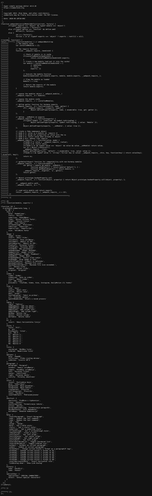                                   |
| 200         | http://10.10.10.10/Editor/lang/summernote-hr-HR.min.js                                                                                      | application/javascript        | Apache HTTP Server:2.4.41, Ubuntu                                                                                                     | 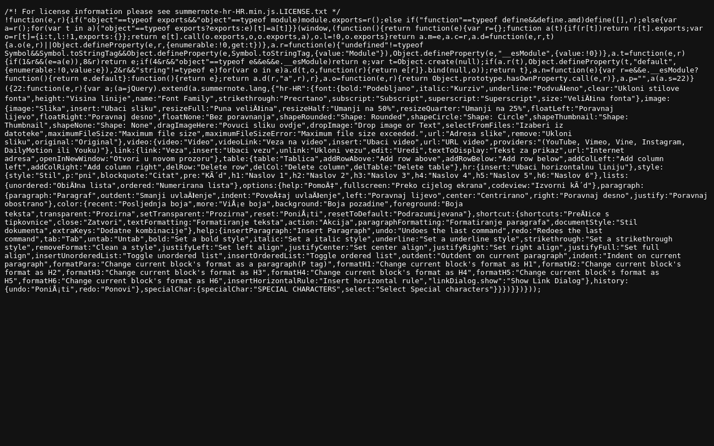                                   |
| 200         | http://10.10.10.10/Editor/lang/summernote-hr-HR.min.js.LICENSE.txt                                                                          | text/plain                    | Apache HTTP Server:2.4.41, Ubuntu                                                                                                     |                                    |
| 200         | http://10.10.10.10/Editor/lang/summernote-he-IL.min.js                                                                                      | application/javascript        | Apache HTTP Server:2.4.41, Ubuntu                                                                                                     | 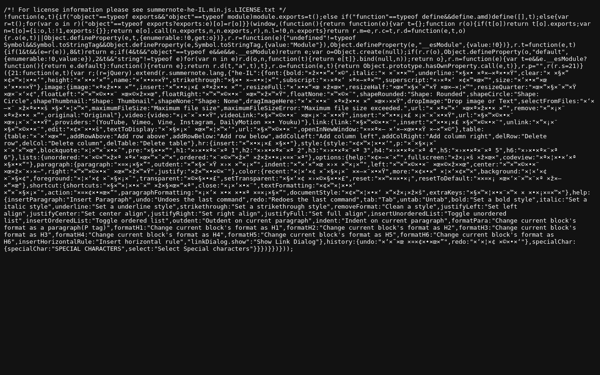                                   |
| 200         | http://10.10.10.10/Editor/lang/summernote-hu-HU.min.js                                                                                      | application/javascript        | Apache HTTP Server:2.4.41, Ubuntu                                                                                                     | 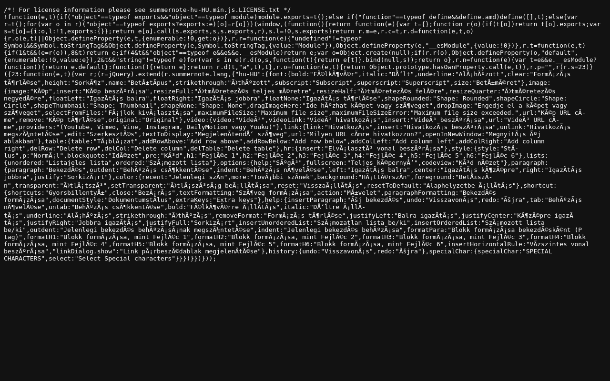                                   |
| 200         | http://10.10.10.10/Editor/lang/summernote-hu-HU.min.js.LICENSE.txt                                                                          | text/plain                    | Apache HTTP Server:2.4.41, Ubuntu                                                                                                     | 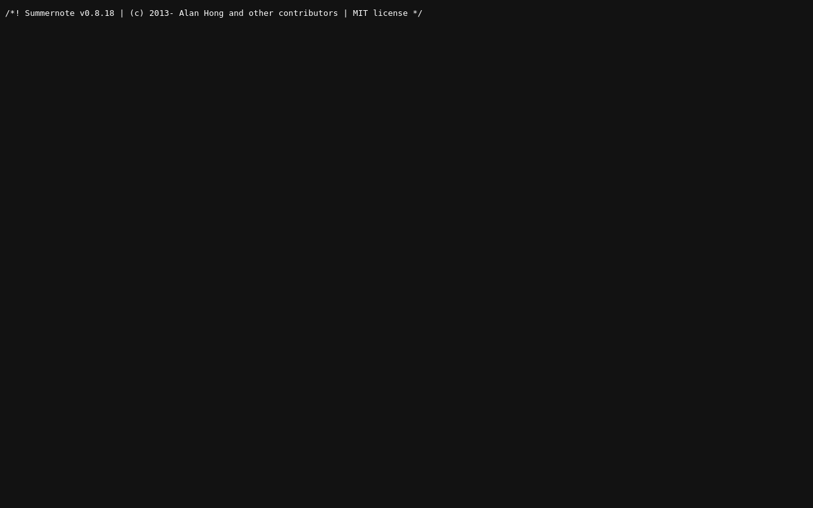                                     |
| 200         | http://10.10.10.10/Editor/lang/summernote-el-GR.min.js.LICENSE.txt                                                                          | text/plain                    | Apache HTTP Server:2.4.41, Ubuntu                                                                                                     |                                    |
| 200         | http://10.10.10.10/Editor/lang/summernote-id-ID.js                                                                                          | application/javascript        | Apache HTTP Server:2.4.41, Ubuntu                                                                                                     | 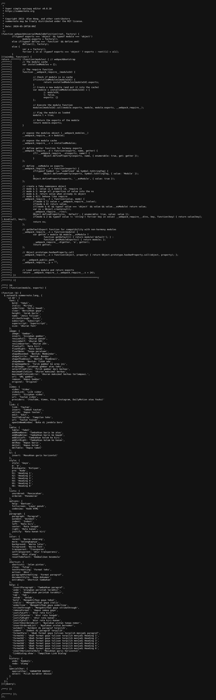                                     |
| 200         | http://10.10.10.10/Editor/lang/summernote-da-DK.min.js.LICENSE.txt                                                                          | text/plain                    | Apache HTTP Server:2.4.41, Ubuntu                                                                                                     |                                    |
| 200         | http://10.10.10.10/Editor/lang/summernote-de-DE.min.js.LICENSE.txt                                                                          | text/plain                    | Apache HTTP Server:2.4.41, Ubuntu                                                                                                     |                                    |
| 200         | http://10.10.10.10/Editor/lang/summernote-fa-IR.min.js                                                                                      | application/javascript        | Apache HTTP Server:2.4.41, Ubuntu                                                                                                     |                                    |
| 200         | http://10.10.10.10/Editor/lang/summernote-cs-CZ.min.js.LICENSE.txt                                                                          | text/plain                    | Apache HTTP Server:2.4.41, Ubuntu                                                                                                     |                                    |
| 200         | http://10.10.10.10/Editor/lang/summernote-es-ES.min.js.LICENSE.txt                                                                          | text/plain                    | Apache HTTP Server:2.4.41, Ubuntu                                                                                                     |                                    |
| 200         | http://10.10.10.10/Editor/lang/summernote-ar-AR.min.js.LICENSE.txt                                                                          | text/plain                    | Apache HTTP Server:2.4.41, Ubuntu                                                                                                     |                                    |
| 200         | http://10.10.10.10/Editor/lang/summernote-cs-CZ.min.js                                                                                      | application/javascript        | Apache HTTP Server:2.4.41, Ubuntu                                                                                                     |                                    |
| 200         | http://10.10.10.10/Editor/lang/summernote-fa-IR.min.js.LICENSE.txt                                                                          | text/plain                    | Apache HTTP Server:2.4.41, Ubuntu                                                                                                     |                                    |
| 200         | http://10.10.10.10/Editor/lang/summernote-es-EU.min.js.LICENSE.txt                                                                          | text/plain                    | Apache HTTP Server:2.4.41, Ubuntu                                                                                                     |                                    |
| 200         | http://10.10.10.10/Editor/lang/summernote-fr-FR.min.js                                                                                      | application/javascript        | Apache HTTP Server:2.4.41, Ubuntu                                                                                                     |                                    |
| 200         | http://10.10.10.10/Editor/lang/summernote-fr-FR.min.js.LICENSE.txt                                                                          | text/plain                    | Apache HTTP Server:2.4.41, Ubuntu                                                                                                     |                                    |
| 200         | http://10.10.10.10/Editor/lang/summernote-ar-AR.min.js                                                                                      | application/javascript        | Apache HTTP Server:2.4.41, Ubuntu                                                                                                     |                                    |
| 200         | http://10.10.10.10/Editor/lang/summernote-fa-IR.js                                                                                          | application/javascript        | Apache HTTP Server:2.4.41, Ubuntu                                                                                                     |                                    |
| 200         | http://10.10.10.10/Editor/lang/summernote-es-EU.js                                                                                          | application/javascript        | Apache HTTP Server:2.4.41, Ubuntu                                                                                                     |                                    |
| 200         | http://10.10.10.10/Editor/lang/summernote-el-GR.js                                                                                          | application/javascript        | Apache HTTP Server:2.4.41, Ubuntu                                                                                                     |                                    |
| 200         | http://10.10.10.10/Editor/lang/summernote-hu-HU.js                                                                                          | application/javascript        | Apache HTTP Server:2.4.41, Ubuntu                                                                                                     | 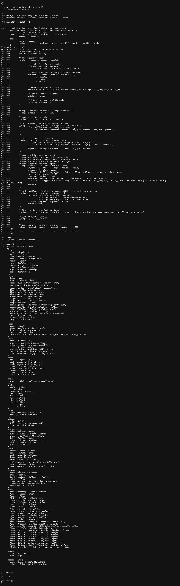                                   |
| 200         | http://10.10.10.10/Editor/lang/summernote-es-ES.js                                                                                          | application/javascript        | Apache HTTP Server:2.4.41, Ubuntu                                                                                                     |                                    |
| 200         | http://10.10.10.10/Editor/lang/summernote-el-GR.min.js                                                                                      | application/javascript        | Apache HTTP Server:2.4.41, Ubuntu                                                                                                     |                                    |
| 200         | http://10.10.10.10/Editor/lang/summernote-da-DK.min.js                                                                                      | application/javascript        | Apache HTTP Server:2.4.41, Ubuntu                                                                                                     |                                    |
| 200         | http://10.10.10.10/Editor/lang/summernote-ar-AR.js                                                                                          | application/javascript        | Apache HTTP Server:2.4.41, Ubuntu                                                                                                     |                                    |
| 200         | http://10.10.10.10/Editor/lang/summernote-ca-ES.min.js.LICENSE.txt                                                                          | text/plain                    | Apache HTTP Server:2.4.41, Ubuntu                                                                                                     |                                    |
| 200         | http://10.10.10.10/Editor/lang/summernote-de-DE.min.js                                                                                      | application/javascript        | Apache HTTP Server:2.4.41, Ubuntu                                                                                                     |                                    |
| 200         | http://10.10.10.10/Editor/lang/summernote-fi-FI.min.js                                                                                      | application/javascript        | Apache HTTP Server:2.4.41, Ubuntu                                                                                                     |                                    |
| 200         | http://10.10.10.10/Editor/lang/summernote-fi-FI.min.js.LICENSE.txt                                                                          | text/plain                    | Apache HTTP Server:2.4.41, Ubuntu                                                                                                     |                                    |
| 200         | http://10.10.10.10/Editor/lang/summernote-da-DK.js                                                                                          | application/javascript        | Apache HTTP Server:2.4.41, Ubuntu                                                                                                     |                                    |
| 200         | http://10.10.10.10/Editor/lang/summernote-es-ES.min.js                                                                                      | application/javascript        | Apache HTTP Server:2.4.41, Ubuntu                                                                                                     |                                    |
| 200         | http://10.10.10.10/Editor/lang/summernote-es-EU.min.js                                                                                      | application/javascript        | Apache HTTP Server:2.4.41, Ubuntu                                                                                                     |                                    |
| 200         | http://10.10.10.10/Editor/lang/summernote-gl-ES.min.js                                                                                      | application/javascript        | Apache HTTP Server:2.4.41, Ubuntu                                                                                                     |                                    |
| 200         | http://10.10.10.10/Editor/lang/summernote-bg-BG.min.js                                                                                      | application/javascript        | Apache HTTP Server:2.4.41, Ubuntu                                                                                                     |                                    |
| 200         | http://10.10.10.10/Editor/lang/summernote-ca-ES.min.js                                                                                      | application/javascript        | Apache HTTP Server:2.4.41, Ubuntu                                                                                                     |                                    |
| 200         | http://10.10.10.10/Editor/lang/summernote-az-AZ.min.js.LICENSE.txt                                                                          | text/plain                    | Apache HTTP Server:2.4.41, Ubuntu                                                                                                     |                                    |
| 200         | http://10.10.10.10/Editor/lang/summernote-de-DE.js                                                                                          | application/javascript        | Apache HTTP Server:2.4.41, Ubuntu                                                                                                     |                                    |
| 200         | http://10.10.10.10/Editor/lang/summernote-ca-ES.js                                                                                          | application/javascript        | Apache HTTP Server:2.4.41, Ubuntu                                                                                                     |                                    |
| 200         | http://10.10.10.10/Editor/lang/summernote-bg-BG.min.js.LICENSE.txt                                                                          | text/plain                    | Apache HTTP Server:2.4.41, Ubuntu                                                                                                     |                                    |
| 200         | http://10.10.10.10/Editor/lang/summernote-az-AZ.min.js                                                                                      | application/javascript        | Apache HTTP Server:2.4.41, Ubuntu                                                                                                     |                                    |
| 200         | http://10.10.10.10/Editor/lang/summernote-bg-BG.js                                                                                          | application/javascript        | Apache HTTP Server:2.4.41, Ubuntu                                                                                                     |                                    |
| 200         | http://10.10.10.10/Editor/lang/summernote-fr-FR.js                                                                                          | application/javascript        | Apache HTTP Server:2.4.41, Ubuntu                                                                                                     |                                    |
| 200         | http://10.10.10.10/Deals.php                                                                                                                | text/html                     | Apache HTTP Server:2.4.41, Ubuntu                                                                                                     |                                    |
| 200         | http://10.10.10.10/Editor/lang/summernote-cs-CZ.js                                                                                          | application/javascript        | Apache HTTP Server:2.4.41, Ubuntu                                                                                                     |                                    |
| 200         | http://10.10.10.10/Editor/lang/summernote-fi-FI.js                                                                                          | application/javascript        | Apache HTTP Server:2.4.41, Ubuntu                                                                                                     |                                    |
| 200         | http://10.10.10.10/Editor/lang/summernote-gl-ES.js                                                                                          | application/javascript        | Apache HTTP Server:2.4.41, Ubuntu                                                                                                     |                                    |
| 200         | http://10.10.10.10/Editor/lang/summernote-az-AZ.js                                                                                          | application/javascript        | Apache HTTP Server:2.4.41, Ubuntu                                                                                                     |                                    |
| 200         | http://10.10.10.10/                                                                                                                         | text/html                     | Apache HTTP Server:2.4.41, Ubuntu                                                                                                     |                                    |
| 200         | http://10.10.10.10/Editor/Editor.php                                                                                                        | text/html                     | Apache HTTP Server:2.4.41, Bootstrap:4.4.1, BootstrapCDN:4.4.1, Popper, Summernote:0.8.18, Ubuntu, jQuery CDN, jQuery:3.5.1, jsDelivr |                                    |
| 200         | http://10.10.10.10/Editor                                                                                                                   | text/html                     | Apache HTTP Server:2.4.41, Ubuntu                                                                                                     |                                    |
| 200         | http://10.10.10.10/Admin.php                                                                                                                | text/html                     | Apache HTTP Server:2.4.41, Bootstrap:4.4.1, BootstrapCDN:4.4.1, Summernote:0.8.18, Ubuntu, jQuery CDN, jQuery:3.5.1, jsDelivr         |                                    |
| 200         | http://10.10.10.10/Editor/lang/summernote-gl-ES.min.js.LICENSE.txt                                                                          | text/plain                    | Apache HTTP Server:2.4.41, Ubuntu                                                                                                     |                                    |
| 200         | http://10.10.10.10/Editor/lang/summernote-he-IL.js                                                                                          | application/javascript        | Apache HTTP Server:2.4.41, Ubuntu                                                                                                     |                                    |
| 200         | http://10.10.10.10/Editor/lang/summernote-sr-RS-Latin.min.js.LICENSE.txt                                                                    | text/plain                    | Apache HTTP Server:2.4.41, Ubuntu                                                                                                     |                                      |
| 200         | http://10.10.10.10/Editor/lang/summernote-sr-RS.js                                                                                          | application/javascript        | Apache HTTP Server:2.4.41, Ubuntu                                                                                                     | 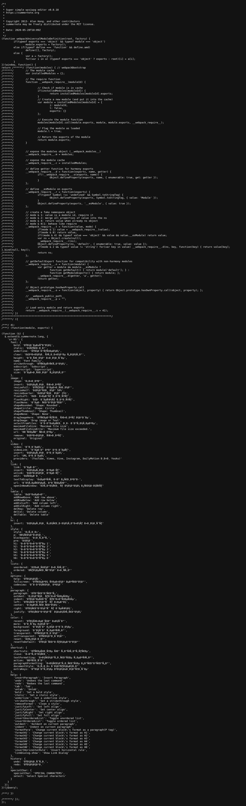                                     |
| 200         | http://10.10.10.10/Editor/lang/summernote-sr-RS.min.js                                                                                      | application/javascript        | Apache HTTP Server:2.4.41, Ubuntu                                                                                                     | 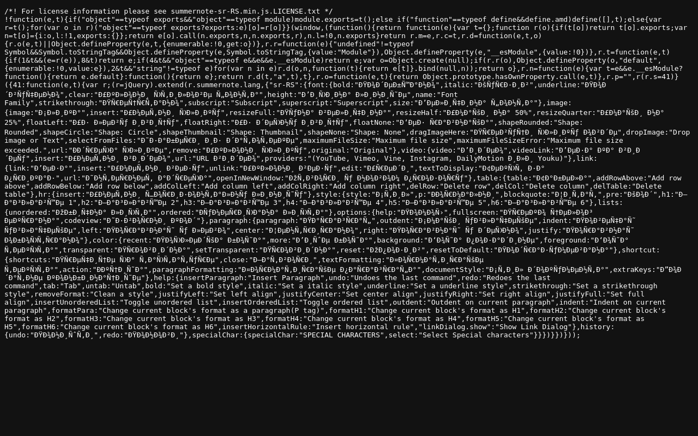                                     |
| 200         | http://10.10.10.10/Editor/lang/summernote-sr-RS.min.js.LICENSE.txt                                                                          | text/plain                    | Apache HTTP Server:2.4.41, Ubuntu                                                                                                     |                                      |
| 200         | http://10.10.10.10/Editor/lang/summernote-sr-RS-Latin.min.js                                                                                | application/javascript        | Apache HTTP Server:2.4.41, Ubuntu                                                                                                     | 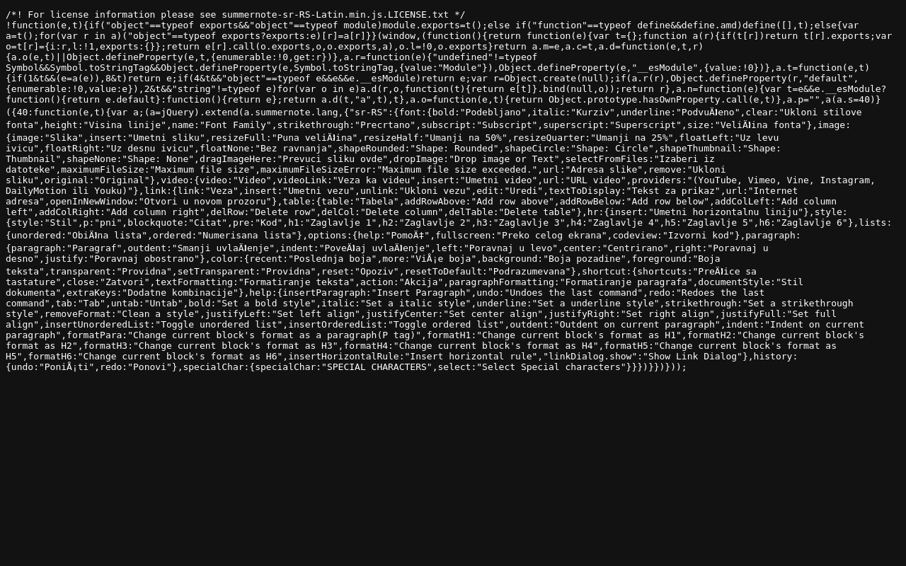                                     |
| 200         | http://10.10.10.10/Editor/lang/summernote-id-ID.min.js                                                                                      | application/javascript        | Apache HTTP Server:2.4.41, Ubuntu                                                                                                     |                                      |
| 200         | http://10.10.10.10/Editor/lang/summernote-id-ID.min.js.LICENSE.txt                                                                          | text/plain                    | Apache HTTP Server:2.4.41, Ubuntu                                                                                                     |                                      |
| 200         | http://10.10.10.10/Editor/lang/summernote-it-IT.min.js.LICENSE.txt                                                                          | text/plain                    | Apache HTTP Server:2.4.41, Ubuntu                                                                                                     |                                      |
| 200         | http://10.10.10.10/Editor/lang/summernote-ja-JP.min.js                                                                                      | application/javascript        | Apache HTTP Server:2.4.41, Ubuntu                                                                                                     |                                      |
| 200         | http://10.10.10.10/Editor/lang/summernote-it-IT.min.js                                                                                      | application/javascript        | Apache HTTP Server:2.4.41, Ubuntu                                                                                                     |                                      |
| 200         | http://10.10.10.10/Editor/lang/summernote-it-IT.js                                                                                          | application/javascript        | Apache HTTP Server:2.4.41, Ubuntu                                                                                                     |                                      |
| 200         | http://10.10.10.10/Editor/lang/summernote-ja-JP.js                                                                                          | application/javascript        | Apache HTTP Server:2.4.41, Ubuntu                                                                                                     |                                      |
| 200         | http://10.10.10.10/Editor/lang/summernote-ja-JP.min.js.LICENSE.txt                                                                          | text/plain                    | Apache HTTP Server:2.4.41, Ubuntu                                                                                                     |                                      |
| 200         | http://10.10.10.10/Editor/lang/summernote-ko-KR.js                                                                                          | application/javascript        | Apache HTTP Server:2.4.41, Ubuntu                                                                                                     |                                      |
| 200         | http://10.10.10.10/Editor/lang/summernote-ko-KR.min.js                                                                                      | application/javascript        | Apache HTTP Server:2.4.41, Ubuntu                                                                                                     |                                      |
| 200         | http://10.10.10.10/Editor/lang/summernote-ko-KR.min.js.LICENSE.txt                                                                          | text/plain                    | Apache HTTP Server:2.4.41, Ubuntu                                                                                                     |                                      |
| 200         | http://10.10.10.10/Editor/lang/summernote-lt-LT.js                                                                                          | application/javascript        | Apache HTTP Server:2.4.41, Ubuntu                                                                                                     |                                      |
| 200         | http://10.10.10.10/Editor/lang/summernote-lt-LT.min.js.LICENSE.txt                                                                          | text/plain                    | Apache HTTP Server:2.4.41, Ubuntu                                                                                                     |                                      |
| 200         | http://10.10.10.10/Editor/lang/summernote-lt-LT.min.js                                                                                      | application/javascript        | Apache HTTP Server:2.4.41, Ubuntu                                                                                                     |                                      |
| 200         | http://10.10.10.10/Editor/lang/summernote-lt-LV.js                                                                                          | application/javascript        | Apache HTTP Server:2.4.41, Ubuntu                                                                                                     |                                      |
| 200         | http://10.10.10.10/Editor/lang/summernote-lt-LV.min.js                                                                                      | application/javascript        | Apache HTTP Server:2.4.41, Ubuntu                                                                                                     |                                      |
| 200         | http://10.10.10.10/Editor/lang/summernote-lt-LV.min.js.LICENSE.txt                                                                          | text/plain                    | Apache HTTP Server:2.4.41, Ubuntu                                                                                                     |                                      |
| 200         | http://10.10.10.10/Editor/lang/summernote-mn-MN.js                                                                                          | application/javascript        | Apache HTTP Server:2.4.41, Ubuntu                                                                                                     |                                      |
| 200         | http://10.10.10.10/Editor/lang/summernote-mn-MN.min.js                                                                                      | application/javascript        | Apache HTTP Server:2.4.41, Ubuntu                                                                                                     |                                      |
| 200         | http://10.10.10.10/Editor/lang/summernote-mn-MN.min.js.LICENSE.txt                                                                          | text/plain                    | Apache HTTP Server:2.4.41, Ubuntu                                                                                                     |                                      |
| 200         | http://10.10.10.10/Editor/lang/summernote-nb-NO.min.js                                                                                      | application/javascript        | Apache HTTP Server:2.4.41, Ubuntu                                                                                                     |                                      |
| 200         | http://10.10.10.10/Editor/lang/summernote-nb-NO.js                                                                                          | application/javascript        | Apache HTTP Server:2.4.41, Ubuntu                                                                                                     |                                      |
| 200         | http://10.10.10.10/Editor/lang/summernote-nb-NO.min.js.LICENSE.txt                                                                          | text/plain                    | Apache HTTP Server:2.4.41, Ubuntu                                                                                                     |                                      |
| 200         | http://10.10.10.10/Editor/lang/summernote-nl-NL.min.js.LICENSE.txt                                                                          | text/plain                    | Apache HTTP Server:2.4.41, Ubuntu                                                                                                     |                                      |
| 200         | http://10.10.10.10/Editor/lang/summernote-nl-NL.js                                                                                          | application/javascript        | Apache HTTP Server:2.4.41, Ubuntu                                                                                                     |                                      |
| 200         | http://10.10.10.10/Editor/lang/summernote-nl-NL.min.js                                                                                      | application/javascript        | Apache HTTP Server:2.4.41, Ubuntu                                                                                                     |                                      |
| 200         | http://10.10.10.10/Editor/lang/summernote-pl-PL.js                                                                                          | application/javascript        | Apache HTTP Server:2.4.41, Ubuntu                                                                                                     |                                      |
| 200         | http://10.10.10.10/Editor/lang/summernote-pl-PL.min.js                                                                                      | application/javascript        | Apache HTTP Server:2.4.41, Ubuntu                                                                                                     |                                      |
| 200         | http://10.10.10.10/Editor/lang/summernote-pl-PL.min.js.LICENSE.txt                                                                          | text/plain                    | Apache HTTP Server:2.4.41, Ubuntu                                                                                                     |                                      |
| 200         | http://10.10.10.10/Editor/lang/summernote-pt-BR.min.js.LICENSE.txt                                                                          | text/plain                    | Apache HTTP Server:2.4.41, Ubuntu                                                                                                     |                                      |
| 200         | http://10.10.10.10/Editor/lang/summernote-pt-BR.min.js                                                                                      | application/javascript        | Apache HTTP Server:2.4.41, Ubuntu                                                                                                     |                                      |
| 200         | http://10.10.10.10/Editor/lang/summernote-pt-PT.min.js                                                                                      | application/javascript        | Apache HTTP Server:2.4.41, Ubuntu                                                                                                     |                                      |
| 200         | http://10.10.10.10/Editor/lang/summernote-pt-BR.js                                                                                          | application/javascript        | Apache HTTP Server:2.4.41, Ubuntu                                                                                                     |                                      |
| 200         | http://10.10.10.10/Editor/lang/summernote-pt-PT.js                                                                                          | application/javascript        | Apache HTTP Server:2.4.41, Ubuntu                                                                                                     |                                      |
| 200         | http://10.10.10.10/Editor/lang/summernote-pt-PT.min.js.LICENSE.txt                                                                          | text/plain                    | Apache HTTP Server:2.4.41, Ubuntu                                                                                                     |                                      |
| 200         | http://10.10.10.10/Editor/lang/summernote-ro-RO.min.js.LICENSE.txt                                                                          | text/plain                    | Apache HTTP Server:2.4.41, Ubuntu                                                                                                     |                                      |
| 200         | http://10.10.10.10/Editor/lang/summernote-ru-RU.min.js                                                                                      | application/javascript        | Apache HTTP Server:2.4.41, Ubuntu                                                                                                     |                                      |
| 200         | http://10.10.10.10/Editor/lang/summernote-ro-RO.min.js                                                                                      | application/javascript        | Apache HTTP Server:2.4.41, Ubuntu                                                                                                     |                                      |
| 200         | http://10.10.10.10/Editor/lang/summernote-ro-RO.js                                                                                          | application/javascript        | Apache HTTP Server:2.4.41, Ubuntu                                                                                                     |                                      |
| 200         | http://10.10.10.10/Editor/lang/summernote-ru-RU.min.js.LICENSE.txt                                                                          | text/plain                    | Apache HTTP Server:2.4.41, Ubuntu                                                                                                     |                                      |
| 200         | http://10.10.10.10/Editor/lang/summernote-ru-RU.js                                                                                          | application/javascript        | Apache HTTP Server:2.4.41, Ubuntu                                                                                                     |                                      |
| 200         | http://10.10.10.10/Editor/lang/summernote-sk-SK.min.js                                                                                      | application/javascript        | Apache HTTP Server:2.4.41, Ubuntu                                                                                                     |                                      |
| 200         | http://10.10.10.10/Editor/lang/summernote-sk-SK.min.js.LICENSE.txt                                                                          | text/plain                    | Apache HTTP Server:2.4.41, Ubuntu                                                                                                     |                                      |
| 200         | http://10.10.10.10/Editor/lang/summernote-sk-SK.js                                                                                          | application/javascript        | Apache HTTP Server:2.4.41, Ubuntu                                                                                                     |                                      |
| 200         | http://10.10.10.10/Editor/lang/summernote-sl-SI.js                                                                                          | application/javascript        | Apache HTTP Server:2.4.41, Ubuntu                                                                                                     |                                      |
| 200         | http://10.10.10.10/Editor/lang/summernote-sl-SI.min.js                                                                                      | application/javascript        | Apache HTTP Server:2.4.41, Ubuntu                                                                                                     |                                      |
| 200         | http://10.10.10.10/Editor/lang/summernote-sl-SI.min.js.LICENSE.txt                                                                          | text/plain                    | Apache HTTP Server:2.4.41, Ubuntu                                                                                                     |                                      |
| 200         | http://10.10.10.10/Editor/lang/summernote-sr-RS-Latin.js                                                                                    | application/javascript        | Apache HTTP Server:2.4.41, Ubuntu                                                                                                     |                                      |
| 200         | http://10.10.10.10/Editor/lang/summernote-sv-SE.js                                                                                          | application/javascript        | Apache HTTP Server:2.4.41, Ubuntu                                                                                                     |                                      |
| 200         | http://10.10.10.10/Editor/lang/summernote-sv-SE.min.js                                                                                      | application/javascript        | Apache HTTP Server:2.4.41, Ubuntu                                                                                                     |                                      |
| 200         | http://10.10.10.10/Editor/lang/summernote-sv-SE.min.js.LICENSE.txt                                                                          | text/plain                    | Apache HTTP Server:2.4.41, Ubuntu                                                                                                     |                                      |
| 200         | http://10.10.10.10/Editor/lang/summernote-ta-IN.js                                                                                          | application/javascript        | Apache HTTP Server:2.4.41, Ubuntu                                                                                                     |                                      |
| 200         | http://10.10.10.10/Editor/lang/summernote-ta-IN.min.js                                                                                      | application/javascript        | Apache HTTP Server:2.4.41, Ubuntu                                                                                                     |                                      |
| 200         | http://10.10.10.10/Editor/lang/summernote-ta-IN.min.js.LICENSE.txt                                                                          | text/plain                    | Apache HTTP Server:2.4.41, Ubuntu                                                                                                     |                                      |
| 200         | http://10.10.10.10/Editor/lang/summernote-th-TH.js                                                                                          | application/javascript        | Apache HTTP Server:2.4.41, Ubuntu                                                                                                     |                                      |
| 200         | http://10.10.10.10/Editor/lang/summernote-th-TH.min.js                                                                                      | application/javascript        | Apache HTTP Server:2.4.41, Ubuntu                                                                                                     |                                      |
| 200         | http://10.10.10.10/Editor/lang/summernote-th-TH.min.js.LICENSE.txt                                                                          | text/plain                    | Apache HTTP Server:2.4.41, Ubuntu                                                                                                     |                                      |
| 200         | http://10.10.10.10/Editor/lang/summernote-tr-TR.js                                                                                          | application/javascript        | Apache HTTP Server:2.4.41, Ubuntu                                                                                                     |                                      |
| 200         | http://10.10.10.10/Editor/lang/summernote-tr-TR.min.js.LICENSE.txt                                                                          | text/plain                    | Apache HTTP Server:2.4.41, Ubuntu                                                                                                     |                                      |
| 200         | http://10.10.10.10/Editor/lang/summernote-tr-TR.min.js                                                                                      | application/javascript        | Apache HTTP Server:2.4.41, Ubuntu                                                                                                     |                                      |
| 200         | http://10.10.10.10/Editor/lang/summernote-uk-UA.min.js                                                                                      | application/javascript        | Apache HTTP Server:2.4.41, Ubuntu                                                                                                     |                                      |
| 200         | http://10.10.10.10/Editor/lang/summernote-uk-UA.js                                                                                          | application/javascript        | Apache HTTP Server:2.4.41, Ubuntu                                                                                                     |                                      |
| 200         | http://10.10.10.10/Editor/lang/summernote-uk-UA.min.js.LICENSE.txt                                                                          | text/plain                    | Apache HTTP Server:2.4.41, Ubuntu                                                                                                     |                                      |
| 200         | http://10.10.10.10/Editor/lang/summernote-uz-UZ.min.js                                                                                      | application/javascript        | Apache HTTP Server:2.4.41, Ubuntu                                                                                                     |                                      |
| 200         | http://10.10.10.10/Editor/lang/summernote-uz-UZ.js                                                                                          | application/javascript        | Apache HTTP Server:2.4.41, Ubuntu                                                                                                     |                                      |
| 200         | http://10.10.10.10/Editor/lang/summernote-uz-UZ.min.js.LICENSE.txt                                                                          | text/plain                    | Apache HTTP Server:2.4.41, Ubuntu                                                                                                     |                                      |
| 200         | http://10.10.10.10/Editor/lang/summernote-vi-VN.js                                                                                          | application/javascript        | Apache HTTP Server:2.4.41, Ubuntu                                                                                                     |                                      |
| 200         | http://10.10.10.10/Editor/lang/summernote-vi-VN.min.js.LICENSE.txt                                                                          | text/plain                    | Apache HTTP Server:2.4.41, Ubuntu                                                                                                     |                                      |
| 200         | http://10.10.10.10/Editor/lang/summernote-vi-VN.min.js                                                                                      | application/javascript        | Apache HTTP Server:2.4.41, Ubuntu                                                                                                     |                                      |
| 200         | http://10.10.10.10/Editor/lang/summernote-zh-CN.js                                                                                          | application/javascript        | Apache HTTP Server:2.4.41, Ubuntu                                                                                                     |                                      |
| 200         | http://10.10.10.10/Editor/lang/summernote-zh-CN.min.js                                                                                      | application/javascript        | Apache HTTP Server:2.4.41, Ubuntu                                                                                                     |                                      |
| 200         | http://10.10.10.10/Editor/lang/summernote-zh-CN.min.js.LICENSE.txt                                                                          | text/plain                    | Apache HTTP Server:2.4.41, Ubuntu                                                                                                     |                                      |
| 200         | http://10.10.10.10/Editor/lang/summernote-zh-TW.js                                                                                          | application/javascript        | Apache HTTP Server:2.4.41, Ubuntu                                                                                                     |                                      |
| 200         | http://10.10.10.10/Editor/lang/summernote-zh-TW.min.js                                                                                      | application/javascript        | Apache HTTP Server:2.4.41, Ubuntu                                                                                                     |                                      |
| 200         | http://10.10.10.10/Editor/lang/summernote-zh-TW.min.js.LICENSE.txt                                                                          | text/plain                    | Apache HTTP Server:2.4.41, Ubuntu                                                                                                     |                                      |
| 200         | http://10.10.10.10/Editor/plugin/databasic/summernote-ext-databasic.css                                                                     | text/css                      | Apache HTTP Server:2.4.41, Ubuntu                                                                                                     |                                      |
| 200         | http://10.10.10.10/Editor/plugin/databasic/summernote-ext-databasic.js                                                                      | application/javascript        | Apache HTTP Server:2.4.41, Ubuntu                                                                                                     |                                      |
| 200         | http://10.10.10.10/Editor/plugin/hello/summernote-ext-hello.js                                                                              | application/javascript        | Apache HTTP Server:2.4.41, Ubuntu                                                                                                     |                                      |
| 200         | http://10.10.10.10/Editor/plugin/specialchars/summernote-ext-specialchars.js                                                                | application/javascript        | Apache HTTP Server:2.4.41, Ubuntu                                                                                                     |                                      |
| 200         | http://10.10.10.10/Editor/summernote-bs4.css                                                                                                | text/css                      | Apache HTTP Server:2.4.41, Ubuntu                                                                                                     |                                      |
| 200         | http://10.10.10.10/Editor/summernote-bs4.min.css                                                                                            | text/css                      | Apache HTTP Server:2.4.41, Ubuntu                                                                                                     |                                      |
| 200         | http://10.10.10.10/Editor/summernote-bs4.min.js.LICENSE.txt                                                                                 | text/plain                    | Apache HTTP Server:2.4.41, Ubuntu                                                                                                     |                                      |
| 200         | http://10.10.10.10/Editor/summernote-lite.min.css                                                                                           | text/css                      | Apache HTTP Server:2.4.41, Ubuntu                                                                                                     |                                      |
| 200         | http://10.10.10.10/Editor/summernote-lite.css                                                                                               | text/css                      | Apache HTTP Server:2.4.41, Ubuntu                                                                                                     |                                      |
| 200         | http://10.10.10.10/Editor/summernote-bs4.min.js                                                                                             | application/javascript        | Apache HTTP Server:2.4.41, Ubuntu                                                                                                     |                                      |
| 200         | http://10.10.10.10/Editor/summernote-lite.min.js.LICENSE.txt                                                                                | text/plain                    | Apache HTTP Server:2.4.41, Ubuntu                                                                                                     |                                      |
| 200         | http://10.10.10.10/Editor/summernote.css                                                                                                    | text/css                      | Apache HTTP Server:2.4.41, Ubuntu                                                                                                     |                                      |
| 200         | http://10.10.10.10/Editor/summernote-bs4.js                                                                                                 | application/javascript        | Apache HTTP Server:2.4.41, Ubuntu                                                                                                     |                                      |
| 200         | http://10.10.10.10/Editor/summernote.min.css                                                                                                | text/css                      | Apache HTTP Server:2.4.41, Ubuntu                                                                                                     |                                      |
| 200         | http://10.10.10.10/Editor/summernote-bs4.min.js.map                                                                                         | application/javascript        | Apache HTTP Server:2.4.41, Ubuntu                                                                                                     |                                      |
| 200         | http://10.10.10.10/Editor/summernote-lite.min.js                                                                                            | application/javascript        | Apache HTTP Server:2.4.41, Ubuntu                                                                                                     |                                      |
| 200         | http://10.10.10.10/Editor/summernote-bs4.js.map                                                                                             | application/javascript        | Apache HTTP Server:2.4.41, Ubuntu                                                                                                     |                                      |
| 200         | http://10.10.10.10/Editor/summernote.js                                                                                                     | application/javascript        | Apache HTTP Server:2.4.41, Ubuntu                                                                                                     |                                      |
| 200         | http://10.10.10.10/Editor/summernote.min.js                                                                                                 | application/javascript        | Apache HTTP Server:2.4.41, Ubuntu                                                                                                     |                                      |
| 200         | http://10.10.10.10/Editor/summernote-lite.js                                                                                                | application/javascript        | Apache HTTP Server:2.4.41, Ubuntu                                                                                                     |                                      |
| 200         | http://10.10.10.10/Editor/summernote-lite.min.js.map                                                                                        | application/javascript        | Apache HTTP Server:2.4.41, Ubuntu                                                                                                     |                                      |
| 200         | http://10.10.10.10/Editor/summernote.js.map                                                                                                 | application/javascript        | Apache HTTP Server:2.4.41, Ubuntu                                                                                                     |                                      |
| 200         | http://10.10.10.10/Editor/summernote-lite.js.map                                                                                            | application/javascript        | Apache HTTP Server:2.4.41, Ubuntu                                                                                                     |                                      |
| 200         | http://10.10.10.10/blog/cont                                                                                                                | text/html                     | Apache HTTP Server:2.4.41, MySQL, PHP, Ubuntu, WordPress:6.9.4                                                                        |                                      |
| 200         | http://10.10.10.10/Editor/summernote.min.js.LICENSE.txt                                                                                     | text/plain                    | Apache HTTP Server:2.4.41, Ubuntu                                                                                                     |                                      |
| 200         | http://10.10.10.10/Editor/summernote.min.js.map                                                                                             | application/javascript        | Apache HTTP Server:2.4.41, Ubuntu                                                                                                     |                                      |
| 200         | http://10.10.10.10/Info.php                                                                                                                 | text/html                     | Apache HTTP Server:2.4.41, Ubuntu                                                                                                     |                                      |
| 200         | http://10.10.10.10/JS                                                                                                                       | text/html                     | Apache HTTP Server:2.4.41, Ubuntu                                                                                                     |                                      |
| 200         | http://10.10.10.10/Reviews.php                                                                                                              | text/html                     | Apache HTTP Server:2.4.41, Ubuntu                                                                                                     |                                      |
| 200         | http://10.10.10.10/blog                                                                                                                     | text/html                     | Apache HTTP Server:2.4.41, MySQL, PHP, Ubuntu, WordPress Block Editor, WordPress:6.9.4                                                |                                      |
| 200         | http://10.10.10.10/blog/SA                                                                                                                  | text/html                     | Apache HTTP Server:2.4.41, MySQL, PHP, Ubuntu, WordPress:6.9.4                                                                        |                                      |
| 500         | http://10.10.10.10/login.php                                                                                                                | text/html                     | Apache HTTP Server:2.4.41, Ubuntu                                                                                                     |                                      |
| 200         | http://10.10.10.10/icon/hype.jpg                                                                                                            | image/jpeg                    | Apache HTTP Server:2.4.41, Ubuntu                                                                                                     |                                      |
| 200         | http://10.10.10.10/blog/w                                                                                                                   | text/html                     | Apache HTTP Server:2.4.41, MySQL, PHP, Ubuntu, WordPress:6.9.4                                                                        |                                      |
| 200         | http://10.10.10.10/blog/wp-feed.php                                                                                                         | application/rss+xml           | Apache HTTP Server:2.4.41, MySQL, PHP, Ubuntu, WordPress                                                                              |                                      |
| 200         | http://10.10.10.10/css                                                                                                                      | text/html                     | Apache HTTP Server:2.4.41, Ubuntu                                                                                                     |                                      |
| 200         | http://10.10.10.10/css/                                                                                                                     | text/html                     | Apache HTTP Server:2.4.41, Ubuntu                                                                                                     |                                      |
| 200         | http://10.10.10.10/css/style.css                                                                                                            | text/css                      | Apache HTTP Server:2.4.41, Ubuntu                                                                                                     |                                      |
| 200         | http://10.10.10.10/dashboard                                                                                                                | text/html                     | Apache HTTP Server:2.4.41, Ubuntu                                                                                                     |                                      |
| 200         | http://10.10.10.10/dashboard/index.php                                                                                                      | text/html                     | Apache HTTP Server:2.4.41, Ubuntu                                                                                                     |                                      |
| 200         | http://10.10.10.10/css/bootswatch.css                                                                                                       | text/css                      | Apache HTTP Server:2.4.41, Ubuntu                                                                                                     |                                      |
| 200         | http://10.10.10.10/topsecret.html                                                                                                           | text/html                     | Apache HTTP Server:2.4.41, Ubuntu                                                                                                     |  |
| 200         | http://10.10.10.10/exercises                                                                                                                | text/html                     | Apache HTTP Server:2.4.41, Ubuntu                                                                                                     |                                      |
| 200         | http://10.10.10.10/support.php                                                                                                              | text/html                     | Apache HTTP Server:2.4.41, Ubuntu                                                                                                     | 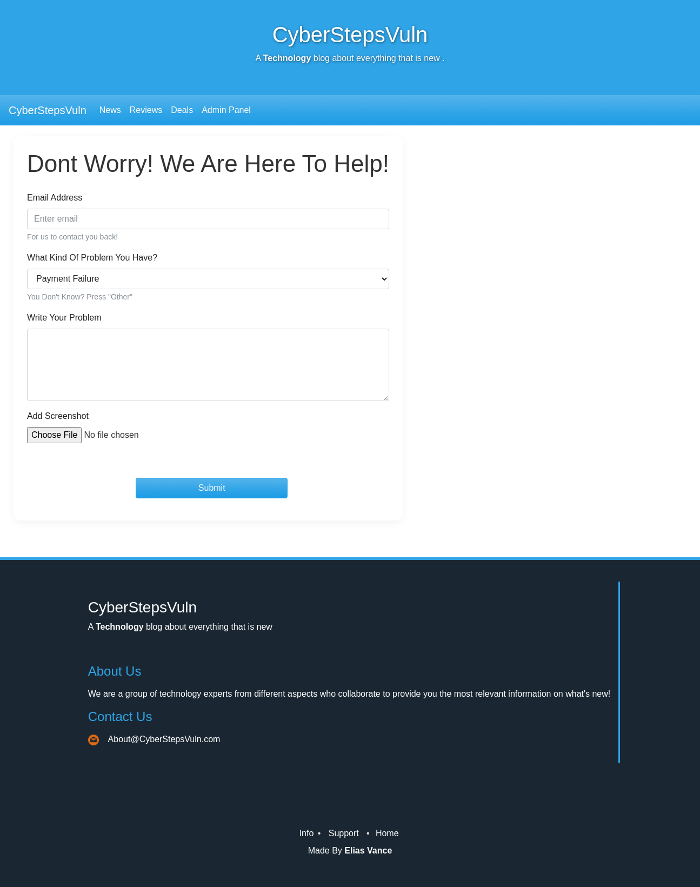                                     |
| 200         | http://10.10.10.10/icon/                                                                                                                    | text/html                     | Apache HTTP Server:2.4.41, Ubuntu                                                                                                     |                                      |
| 200         | http://10.10.10.10/icon/Backpack.png                                                                                                        | image/png                     | Apache HTTP Server:2.4.41, Ubuntu                                                                                                     |                                      |
| 200         | http://10.10.10.10/icon/Clone.png                                                                                                           | image/png                     | Apache HTTP Server:2.4.41, Ubuntu                                                                                                     |                                      |
| 200         | http://10.10.10.10/icon/Fish.png                                                                                                            | image/png                     | Apache HTTP Server:2.4.41, Ubuntu                                                                                                     |                                      |
| 200         | http://10.10.10.10/icon/Gun.png                                                                                                             | image/png                     | Apache HTTP Server:2.4.41, Ubuntu                                                                                                     |                                      |
| 200         | http://10.10.10.10/icon/Gurlick.png                                                                                                         | image/png                     | Apache HTTP Server:2.4.41, Ubuntu                                                                                                     |                                      |
| 200         | http://10.10.10.10/icon/Headset.png                                                                                                         | image/png                     | Apache HTTP Server:2.4.41, Ubuntu                                                                                                     |                                      |
| 200         | http://10.10.10.10/robots.txt                                                                                                               | text/plain                    | Apache HTTP Server:2.4.41, Ubuntu                                                                                                     |                                      |
| 200         | http://10.10.10.10/index.php                                                                                                                | text/html                     | Apache HTTP Server:2.4.41, Ubuntu                                                                                                     | 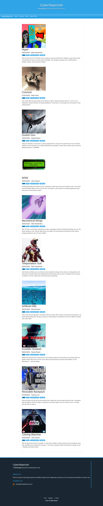                                     |
| 200         | http://10.10.10.10/icon/Instagram.png                                                                                                       | image/png                     | Apache HTTP Server:2.4.41, Ubuntu                                                                                                     |                                      |
| 200         | http://10.10.10.10/icon/Monitor.png                                                                                                         | image/png                     | Apache HTTP Server:2.4.41, Ubuntu                                                                                                     |                                      |
| 200         | http://10.10.10.10/icon/Sausage.png                                                                                                         | image/png                     | Apache HTTP Server:2.4.41, Ubuntu                                                                                                     |                                      |
| 200         | http://10.10.10.10/icon/Suit.png                                                                                                            | image/png                     | Apache HTTP Server:2.4.41, Ubuntu                                                                                                     |                                      |
| 200         | http://10.10.10.10/icon/backpack.png                                                                                                        | image/png                     | Apache HTTP Server:2.4.41, Ubuntu                                                                                                     |                                      |
| 200         | http://10.10.10.10/icon/Wings.png                                                                                                           | image/png                     | Apache HTTP Server:2.4.41, Ubuntu                                                                                                     |                                      |
| 200         | http://10.10.10.10/icon/car.png                                                                                                             | image/png                     | Apache HTTP Server:2.4.41, Ubuntu                                                                                                     |                                      |
| 200         | http://10.10.10.10/icon/banana.png                                                                                                          | image/png                     | Apache HTTP Server:2.4.41, Ubuntu                                                                                                     |                                      |
| 200         | http://10.10.10.10/icon/desktop.png                                                                                                         | image/png                     | Apache HTTP Server:2.4.41, Ubuntu                                                                                                     |                                      |
| 200         | http://10.10.10.10/icon/email.png                                                                                                           | image/png                     | Apache HTTP Server:2.4.41, Ubuntu                                                                                                     |                                      |
| 200         | http://10.10.10.10/icon/headset.png                                                                                                         | image/png                     | Apache HTTP Server:2.4.41, Ubuntu                                                                                                     |                                      |
| 200         | http://10.10.10.10/icon/facebook.png                                                                                                        | image/png                     | Apache HTTP Server:2.4.41, Ubuntu                                                                                                     |                                      |
| 200         | http://10.10.10.10/icon/lcd.png                                                                                                             | image/png                     | Apache HTTP Server:2.4.41, Ubuntu                                                                                                     |                                      |
| 200         | http://10.10.10.10/icon/iCell.png                                                                                                           | image/png                     | Apache HTTP Server:2.4.41, Ubuntu                                                                                                     |                                      |
| 200         | http://10.10.10.10/icon/mr.png                                                                                                              | image/png                     | Apache HTTP Server:2.4.41, Ubuntu                                                                                                     |                                      |
| 200         | http://10.10.10.10/icon/Icell.png                                                                                                           | image/png                     | Apache HTTP Server:2.4.41, Ubuntu                                                                                                     |                                      |
| 200         | http://10.10.10.10/icon/ocean.png                                                                                                           | image/png                     | Apache HTTP Server:2.4.41, Ubuntu                                                                                                     |                                      |
| 200         | http://10.10.10.10/icon/phone.png                                                                                                           | image/png                     | Apache HTTP Server:2.4.41, Ubuntu                                                                                                     |                                      |
| 200         | http://10.10.10.10/icon/robot.png                                                                                                           | image/png                     | Apache HTTP Server:2.4.41, Ubuntu                                                                                                     |                                      |
| 200         | http://10.10.10.10/icon/star.png                                                                                                            | image/png                     | Apache HTTP Server:2.4.41, Ubuntu                                                                                                     |                                      |
| 200         | http://10.10.10.10/icon/smartphone.png                                                                                                      | image/png                     | Apache HTTP Server:2.4.41, Ubuntu                                                                                                     |                                      |
| 200         | http://10.10.10.10/icon/suit.png                                                                                                            | image/png                     | Apache HTTP Server:2.4.41, Ubuntu                                                                                                     |                                      |
| 200         | http://10.10.10.10/icon/twitter.png                                                                                                         | image/png                     | Apache HTTP Server:2.4.41, Ubuntu                                                                                                     |                                      |
| 200         | http://10.10.10.10/icon/wings.png                                                                                                           | image/png                     | Apache HTTP Server:2.4.41, Ubuntu                                                                                                     |                                      |
| 200         | http://10.10.10.10/icon/youtube.png                                                                                                         | image/png                     | Apache HTTP Server:2.4.41, Ubuntu                                                                                                     |                                      |
